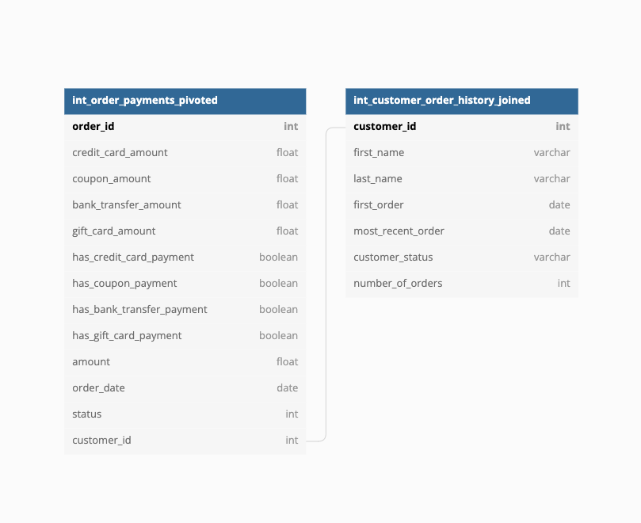

## Jaffle Shop Metrics 
In case you are unfamiliar with the jaffle_shop dataset and dbt example project, 
I highly recommend you first review this [repository](https://github.com/dbt-labs/jaffle_shop) to familiarize yourself with it. This project builds on top of it
to demonstrate a simple example of a metrics implementation with dbt Metrics 
functionality. 

### Differences From Jaffle Shop
There are a few differences in this example project when compared directly to 
jaffle_shop. They are:
- Customers:
    - Removing the customer_lifetime_value field from customers. 
    - Adding a customer_status field to customers
- Orders:
    - Adding boolean flags for each payment method being present in order

## How To Add Metrics To Jaffle Shop
Now that we've gotten that information out of the way, lets add metrics to the 
jaffle shop dataset! First, lets look at the ERD of the dataset:



Here we can see that our end-state data is based around two models:
- Orders: All information about our orders
- Customers: All information about customers

### The Prompt
Let's say that our Jaffle Shop is really **really** interested in the average 
order amount of our orders - we want to sell more Jaffles! Our CEO has reached
out to ask us to track average order amount but he wants to be able to see
it in the context of payment methods AND customer status. So lets build that out 
with the dbt Metric functionality!

### Materializing 
The CEO has requested this metric contain the ability to slice by customer status,
which is a field that lives in the customers table. dbt does not currently support
join logic which means that we need to create an intermediate model combining orders 
and customers upon which we can build the metric. 

We accomplished this by creating the `combined__orders_customers` model, which serves 
to join `orders` and `customers` and materialize the output so that our metric can
reference dimensions from both of them. 

### Defining
Now that we've materialized the model that we'll use as the base for our metric, 
we need to define the metric we're interested in. Following the format defined 
in the documentation, we created the metric definition shown below:

```yaml
metrics:
  - name: average_order_amount
    label: Average Order Amount
    model: ref('combined__orders_customers')
    description: "The average size of a jaffle order"

    type: average
    sql: amount

    timestamp: order_date
    time_grains: [day, week, month]

    dimensions:
      - has_credit_card_payment
      - has_coupon_payment
      - has_bank_transfer_payment
      - has_gift_card_payment
      - customer_status
```


## Resources:
- [What are dbt Metrics?](https://docs.getdbt.com/docs/building-a-dbt-project/metrics#about-metrics)
- [How do I create dbt Metrics?](https://docs.getdbt.com/docs/building-a-dbt-project/metrics#declaring-a-metric)
- [Ongoing Discussions around dbt Metrics](https://docs.getdbt.com/docs/building-a-dbt-project/metrics#ongoing-discussions)